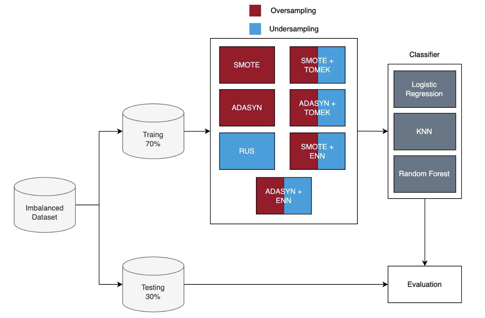
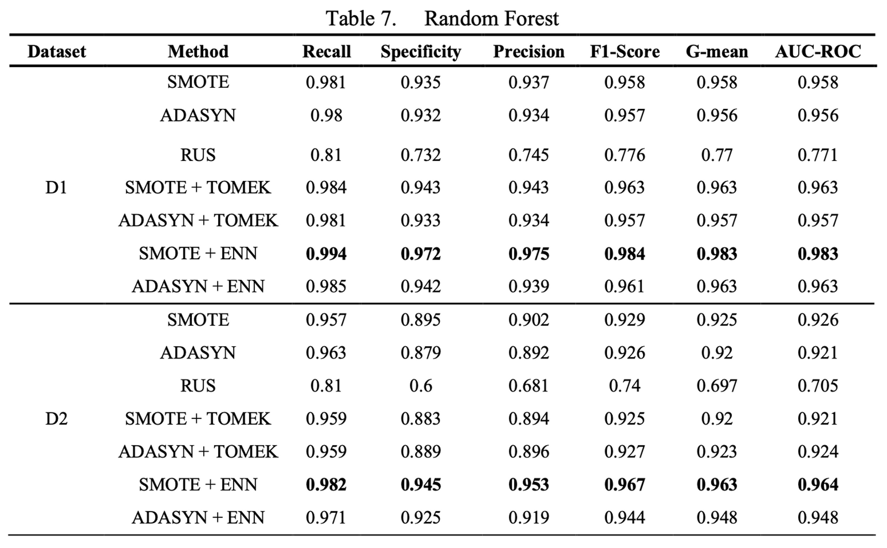

# !Balanced

## Overview

This experiment investigates the challenge of data imbalance in machine learning, prevalent across various sectors such as medicine, finance, and manufacturing. The study focuses on strategies to mitigate the issue, particularly through oversampling, undersampling, and hybrid methods, using algorithms like Random Forest, Logistic Regression, and K-Nearest Neighbors.

## Abstract

Data imbalance skews model performance by disproportionately representing classes. The research explores mitigation strategies, with a significant emphasis on hybrid resampling methods like SMOTE combined with Edited Nearest Neighbors (ENN), which have shown to improve predictions for minority classes significantly.

## Literature Review

Discusses data-level approaches, including oversampling, undersampling, and hybrid methods, their impact on model performance, and the importance of various evaluation metrics.

## Datasets Used

In our study, public datasets from the kaggle repository. There are two binary class datasets with different imbalanced ratios (IR). The datasets used are Stroke Prediction Dataset (SP), Cerebral Stroke Prediction-Imbalanced Dataset (CSPI). The following Table 1 is a description of each dataset, including the number of instances, the number of attributes, and the imbalanced ratio (IR).

| Dataset                                                                                               | Number of Instances | Attributes | IR  |
| ----------------------------------------------------------------------------------------------------- | ------------------- | ---------- | --- |
| [CSPI](https://www.kaggle.com/datasets/shashwatwork/cerebral-stroke-predictionimbalaced-dataset/data) | 43400               | 122        | 54  |
| [SP](https://www.kaggle.com/datasets/fedesoriano/stroke-prediction-dataset?rvi=1)                     | 5110                | 12         | 20  |

These datasets provide a varied perspective on the challenges and effects of data imbalance in different contexts.

## Methodology

Describes the datasets used, the research stages, and the pre-processing methods like Label Encoding and One-hot Encoding, leading to feature selection for model performance improvement.

## Results and Analysis

Presents the findings from applying different resampling methods to the datasets, highlighting how these methods affect model performance across various metrics.

## Conclusion

Summarizes the study’s findings on the impact of different data imbalance handling methods, with a focus on hybrid resampling methods like **SMOTE + ENN** for improving model performance in imbalanced datasets.
