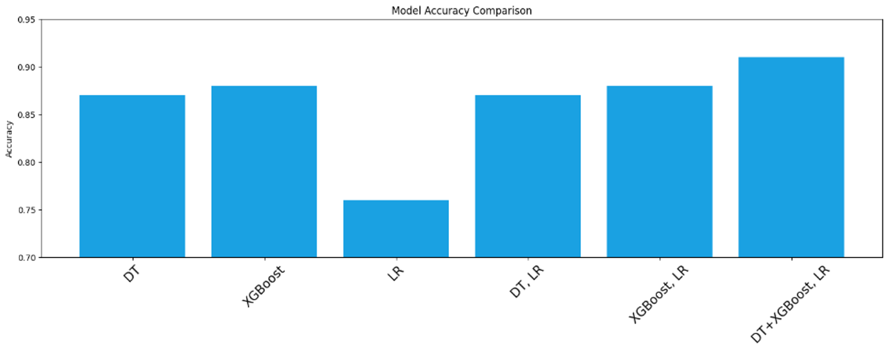

# To Ensemble And Beyond

## Kaggle

[Boy or Girl 2024 new](https://www.kaggle.com/competitions/boy-or-girl-2024-new)

## Introduction

The experiment focused on gender prediction using sentiment analysis and an ensemble learning strategy. It evaluated the effects of feature engineering on model performance and utilized a stacking classifier combining decision trees, XGBoost, and logistic regression to enhance prediction accuracy.

## Research Method

### Preprocessing

- **Remove Outlier & Data Imputation:** Removes outliers in height, weight, fb_friends, and yt columns and imputes missing values with mean or mode
  

- **One-Hot:** converting categorical values into binary columns for each category.

- **TF-IDF:** converts the self_intro text column into numerical features using TF-IDF vectorization, limiting to the top 100 features.
  

The overlap in training and test set distributions suggests that the model may generalize well from training to testing data.

- **SMOTE+TOMEK:** The overlap in training and test set distributions suggests that the model may generalize well from training to testing data.
  

### Model

The superior performance of DT+XGBoost with LR model can be attributed to several factors:

- **Diversity:** Combining DT and XGBoost introduces a variety of decision-making processes and learning patterns, which can capture a broader range of data complexities.
- **Complementarity:** DT might capture certain aspects of the data, while XGBoost could be capturing other aspects. Together, they provide a more comprehensive understanding of the data.
- **Error Correction:** If DT overfits or XGBoost underfits, the other can compensate, improving overall performance.
- **Meta Learning:** Logistic Regression as a meta-learner can effectively weigh the predictions from the base models, fine-tuning the final decision boundary.

## Results

- **Targeted Precision:** "Girl" class exhibits high precision, indicating specific accuracy in its identification.
- **Broad Recall:** "Boy" class shows high recall, capturing a large proportion of its instances.
- **Balanced Accuracy:** F1-score for "Boy" is higher, showing a well-rounded precision-recall balance.
- **Consistent Performance:** Micro-average scores are uniform, revealing consistent instance-level accuracy.
  Overall Efficacy: Macro-average scores are robust, denoting effective performance across classes.

## Acknowledge

- Thank you teacher for giving us so many teaching materials and for being so attentive in class.
- Thank you to the team members for staying up many nights to make this assignment.
- Thank God, we got number one.

