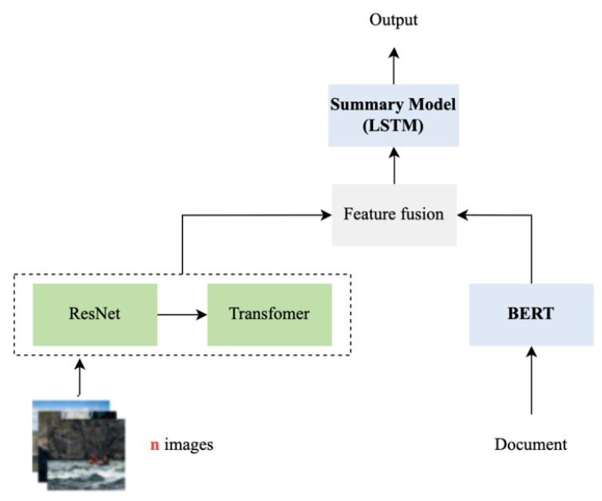
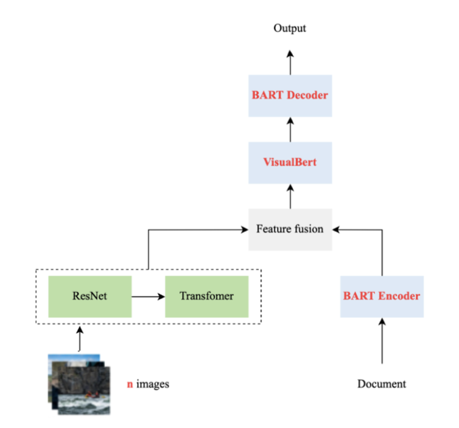

# Multimodal Summarization: Integrating Text and Image Inputs for Enhanced Text and Visual Summaries

## Authors

- Ingrid Lin - ingridlin0303@gmail.com
- Jim Fang - jmjmjim1101@gmail.com
- Joyu Wu - jjjoyuwu@gmail.com

## Abstract

This research explores a novel approach to multimodal summarization by dynamically integrating features extracted from text and images using pretrained models like ResNet50, BART, and VisualBERT. Our method aims to generate coherent text summaries accompanied by representative images, thereby improving the overall quality and informativeness of the summaries. Through empirical evaluation using ROUGE metrics, cosine similarity, and Euclidean distance, we demonstrate that our approach significantly outperforms traditional text-only summarization methods. Despite the promising outcomes, our research is limited by the size of the dataset, which is constrained by our hardware capabilities.

## Problem Statement

Traditional summarization techniques have focused primarily on text, but the inclusion of images adds context and appeal, improving the informativeness of summaries. Our method aims to improve the quality of image selection in current multimodal summarization approaches by dynamically integrating visual and textual information to generate coherent summaries.

## Methodology

### Data Collection and Processing

Our dataset originates from the Daily Mail website (MSMO), containing 14,507 training texts and 94,580 images, and 10,262 test texts and 68,521 images. We extracted the title, body, and summary from each text file and organized these elements into a CSV file for further processing.

### Baseline Method

We chose the paper "Exploiting Pseudo Image Captions for Multimodal Summarization" as our baseline due to its innovative approach to bridging the semantic gap between visual and textual modalities in multimodal summarization tasks. The baseline method integrates the ResNet and Transformer models for feature extraction from images and text, respectively. The extracted features are then fused and processed by an LSTM-based summary model to generate the final output.

#### Baseline Models Used

1. **DistilBERT**: Used for text preprocessing and feature extraction. It is a streamlined version of BERT that retains 97% of BERT's language understanding capabilities but is 60% faster.
2. **ResNet152**: Used for image feature extraction. It is a deep residual network with 152 layers, highly effective in image recognition tasks.
3. **LSTM (Long Short-Term Memory)**: Used for decoding and generating text summaries. LSTM is effective for sequence prediction tasks, remembering past information and forgetting irrelevant details.

   

### Proposed Method

#### Models Used

1. **ResNet50**: Used for image feature extraction.
2. **BART**: Used for text feature extraction and text summarization.
3. **VisualBERT**: Used for refining the combined visual and textual features.

#### Steps

1. **Text Data Processing**: Preprocess text data using BART model to extract textual features.
2. **Image Data Processing**: Process image data using ResNet50 model to extract image features.
3. **Feature Fusion**: Integrate text and image features using VisualBERT model.
4. **Summary Generation**: Generate final text summary using BART decoder.

   

### Evaluation Metrics

1. **ROUGE**: Used to evaluate the overlap between generated and reference summaries.
   - ROUGE-1: Unigram level matching
   - ROUGE-2: Bigram level matching
   - ROUGE-L: Longest common subsequence matching
2. **Cosine Similarity**: Used to evaluate the similarity between feature vectors of generated and reference summaries.
3. **Euclidean Distance**: Used to measure the difference between feature vectors of generated and reference summaries.

## Results

The results of our experiments are summarized in the following tables:

### ROUGE Metrics

| Model               | ROUGE-1 | ROUGE-2 | ROUGE-L |
| ------------------- | ------- | ------- | ------- |
| Baseline            | 28.77   | 10.51   | 27.43   |
| BART (Text Only)    | 31.47   | 19.80   | 31.33   |
| BART (Text + Image) | 32.53   | 21.19   | 32.42   |

### Cosine Similarity

| Model    | Cosine Similarity |
| -------- | ----------------- |
| Baseline | 0.039             |
| BART     | 0.04              |

### Euclidean Distance

| Model    | Euclidean Distance |
| -------- | ------------------ |
| Baseline | 53.33              |
| BART     | 50.94              |

## Conclusion

This study presents a novel approach to multimodal summarization that integrates textual and visual data to generate comprehensive and coherent summaries. Our method leverages pretrained models like ResNet50, BART, and VisualBERT to dynamically fuse features from both modalities, resulting in improved performance over traditional text-only summarization methods. Empirical evaluations using ROUGE metrics, cosine similarity, and Euclidean distance demonstrate the effectiveness of our approach in producing high-quality summaries that closely resemble reference summaries in both semantic and structural aspects. The integration of visual information significantly enhances the overall quality and informativeness of the summaries, providing a more holistic understanding of the content. Future research will focus on optimizing the models for larger datasets and refining the feature extraction and integration processes to further improve the performance and applicability of multimodal summarization techniques.

## Limitations and Future Work

### Limitations

- **Hardware Limitations**: Limited computational resources prevented us from using larger datasets.
- **Feature Extraction Issues**: Current methods for extracting features from text and images might not capture key information effectively.
- **Model Selection**: Pretrained models used might not be fully optimized for this specific task.
- **Data Discrepancy**: Inherent differences between text and images may lead to lower similarity scores.
- **Dataset Quality**: Some images in the dataset may not be relevant to the textual content.

### Future Work

- **Expanding the Dataset**: Using larger and more diverse datasets for training and evaluation.
- **Improving Feature Extraction**: Refining methods for extracting and integrating features from both text and images.
- **Exploring More Models**: Comparing various frameworks to determine the most effective approach.
- **Domain-Specific Analysis**: Evaluating models on specific domains to assess their effectiveness.
- **Optimizing Computational Resources**: Leveraging advanced hardware and optimized algorithms to handle larger datasets more efficiently.
